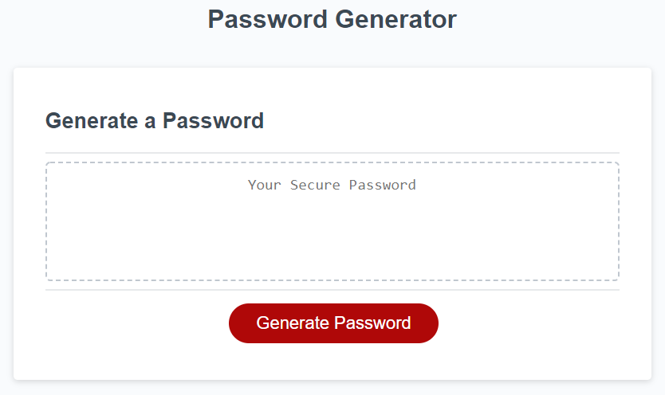

# Password Generator

## Description:

I wanted to build this project in order to improve my skills as a web developer. I felt that this was a very realistic approach and application of my skills while still challenging myself. This generator can randomly create secure passwords based on customizable options that are prompted to the user. I learned a lot about concatonation and randomizing values.

## Table of Contents (Optional)

If your README is long, add a table of contents to make it easy for users to find what they need.

- [Installation](#installation)
- [Usage](#usage)
- [Credits](#credits)
- [License](#license)

## Installation

What are the steps required to install your project? Provide a step-by-step description of how to get the development environment running.

## Usage

Provide instructions and examples for use. Include screenshots as needed.
To use the password generator, click on 'Generate Password' and follow the prompts that appear on the screen. Enter a numerical value between 8 and 128 to set the desired password length. A screenshot is provided below of what the password generator looks like: 

    ```md
    
    ```

## Credits

Password generator starter code retrieved from: https://github.com/coding-boot-camp/friendly-parakeet

## License

MIT License

Copyright (c) 2022 Shauna Lachelier

Permission is hereby granted, free of charge, to any person obtaining a copy
of this software and associated documentation files (the "Software"), to deal
in the Software without restriction, including without limitation the rights
to use, copy, modify, merge, publish, distribute, sublicense, and/or sell
copies of the Software, and to permit persons to whom the Software is
furnished to do so, subject to the following conditions:

The above copyright notice and this permission notice shall be included in all
copies or substantial portions of the Software.

THE SOFTWARE IS PROVIDED "AS IS", WITHOUT WARRANTY OF ANY KIND, EXPRESS OR
IMPLIED, INCLUDING BUT NOT LIMITED TO THE WARRANTIES OF MERCHANTABILITY,
FITNESS FOR A PARTICULAR PURPOSE AND NONINFRINGEMENT. IN NO EVENT SHALL THE
AUTHORS OR COPYRIGHT HOLDERS BE LIABLE FOR ANY CLAIM, DAMAGES OR OTHER
LIABILITY, WHETHER IN AN ACTION OF CONTRACT, TORT OR OTHERWISE, ARISING FROM,
OUT OF OR IN CONNECTION WITH THE SOFTWARE OR THE USE OR OTHER DEALINGS IN THE
SOFTWARE.


---

🏆 Thank you for reading!